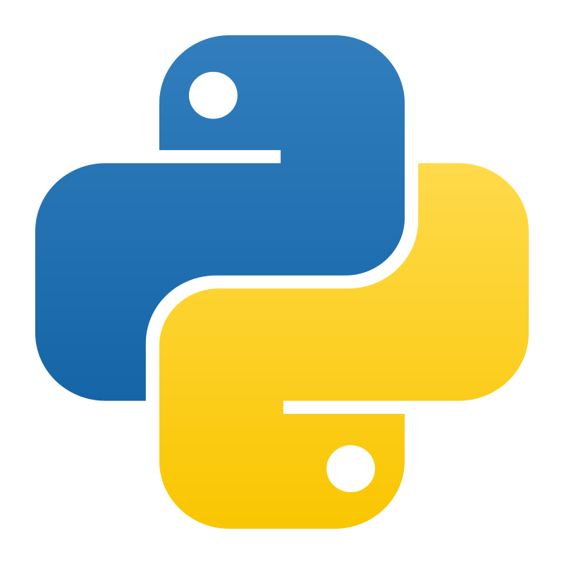

## Hi! 👋  I'm **Blessing Tsekpoe**  

### About Me  
🔹 Passionate **Web Developer** with a love for **Django** and building innovative web apps.  
🔹 Computer Engineering Student at KNUST, Programmer (Python), Graphic Designer, Media Enthusiast.  

### What I’m Learning  
🔹 Mastering **Django** for backend development.  
🔹 Deepening my understanding of **Node JS** & **Databases**.  
🔹 Enhancing my **frontend** skills to complement my backend expertise.  

### Tech Stack  

  
  

  ### Learning

  

### My LinkedIn

